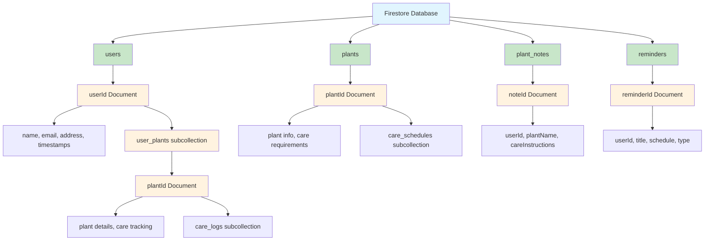

```mermaid
graph TD
    A[Firestore Database] --> B[users]
    A --> C[plants]
    A --> D[plant_notes]
    A --> E[reminders]

    B --> F[userId Document]
    F --> G[name, email, address, timestamps]
    F --> H[user_plants subcollection]

    H --> I[plantId Document]
    I --> J[plant details, care tracking]
    I --> K[care_logs subcollection]

    C --> L[plantId Document]
    L --> M[plant info, care requirements]
    L --> N[care_schedules subcollection]

    D --> O[noteId Document]
    O --> P[userId, plantName, careInstructions]

    E --> Q[reminderId Document]
    Q --> R[userId, title, schedule, type]

    style A fill:#e1f5fe
    style B fill:#c8e6c9
    style C fill:#c8e6c9
    style D fill:#c8e6c9
    style E fill:#c8e6c9
    style F fill:#fff3e0
    style H fill:#fff3e0
    style I fill:#fff3e0
    style L fill:#fff3e0
    style O fill:#fff3e0
    style Q fill:#fff3e0
```
