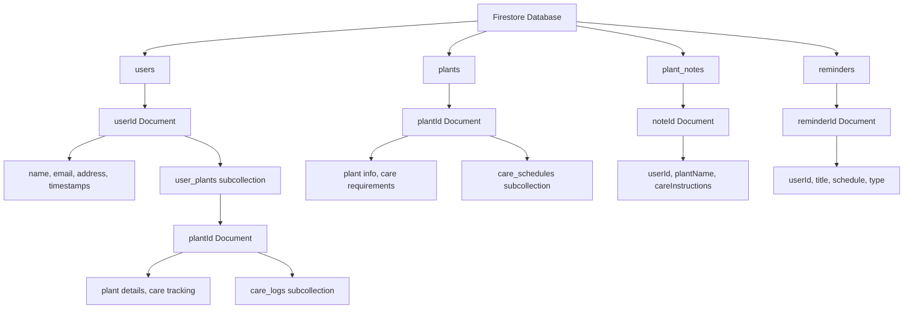

# LeafLine – Firebase Integration & Authentication

## Project Overview

**LeafLine** is a Flutter mobile application that helps plant nursery customers take better care of purchased plants by providing personalized plant care guidance, reminders, and product details through a cloud-connected platform. This deliverable focuses on integrating Firebase Authentication and Cloud Firestore to enable secure user sign-up, login, and real-time data storage.

**Sprint #2 – Task 4:** Firebase Integration: Authentication & Firestore

---

## Cloud Firestore Database Schema Design

### Data Requirements List

Based on LeafLine's core functionality as a plant care guidance app for nursery customers, the following data entities need to be stored:

1. **Users** - Customer profiles and authentication data
2. **Plant Notes** - User's personal plant care observations and notes
3. **Plants** - Plant species database with care information
4. **User Plants** - User's personal plant collection/inventory
5. **Care Schedules** - Recommended care routines for different plants
6. **Care Logs** - Records of care activities performed by users
7. **Reminders** - Scheduled notifications for plant care tasks
8. **Plant Photos** - Image references for user's plants
9. **Plant Care Tips** - General care guidance and best practices

### Firestore Schema Structure

```
Firestore Database Structure
├── users (collection)
│   └── {userId} (document)
│       ├── name: string
│       ├── email: string
│       ├── phone?: string
│       ├── address?: map
│       │   ├── street: string
│       │   ├── city: string
│       │   ├── state: string
│       │   └── zipCode: string
│       ├── profileImageUrl?: string
│       ├── createdAt: timestamp
│       ├── updatedAt: timestamp
│       └── user_plants (subcollection)
│           └── {plantId} (document)
│               ├── plantTypeId: string (reference to plants collection)
│               ├── nickname?: string
│               ├── purchaseDate?: timestamp
│               ├── location?: string
│               ├── healthStatus: string (healthy, needs_attention, critical)
│               ├── lastWatered?: timestamp
│               ├── lastFertilized?: timestamp
│               ├── notes?: string
│               ├── createdAt: timestamp
│               ├── updatedAt: timestamp
│               └── care_logs (subcollection)
│                   └── {logId} (document)
│                       ├── activityType: string (water, fertilize, repot, prune, etc.)
│                       ├── description: string
│                       ├── performedAt: timestamp
│                       └── nextDue?: timestamp
├── plants (collection)
│   └── {plantId} (document)
│       ├── scientificName: string
│       ├── commonName: string
│       ├── category: string (indoor, outdoor, succulent, etc.)
│       ├── difficulty: string (beginner, intermediate, advanced)
│       ├── description: string
│       ├── imageUrl?: string
│       ├── care_requirements: map
│       │   ├── watering: map
│       │   │   ├── frequency: string
│       │   │   ├── amount: string
│       │   │   └── seasonAdjustments?: map
│       │   ├── sunlight: map
│       │   │   ├── intensity: string
│       │   │   └── duration: string
│       │   ├── temperature: map
│       │   │   ├── min: number
│       │   │   └── max: number
│       │   ├── humidity: map
│       │   │   ├── min: number
│       │   │   └── max: number
│       │   ├── soil: map
│       │   │   ├── type: string
│       │   │   └── ph: map
│       │   │       ├── min: number
│       │   │       └── max: number
│       │   └── fertilization: map
│       │       ├── frequency: string
│       │       ├── type: string
│       │       └── seasonAdjustments?: map
│       ├── commonProblems: array<string>
│       ├── careTips: array<string>
│       ├── createdAt: timestamp
│       ├── updatedAt: timestamp
│       └── care_schedules (subcollection)
│           └── {scheduleId} (document)
│               ├── taskType: string (water, fertilize, repot, prune, etc.)
│               ├── frequency: string (daily, weekly, monthly, seasonal)
│               ├── description: string
│               ├── priority: string (low, medium, high)
│               └── seasonAdjustments?: map
├── plant_notes (collection) - Legacy collection for backward compatibility
│   └── {noteId} (document)
│       ├── userId: string
│       ├── plantName: string
│       ├── careInstructions: string
│       ├── createdAt: timestamp
│       └── updatedAt?: timestamp
└── reminders (collection)
    └── {reminderId} (document)
        ├── userId: string
        ├── userPlantId?: string (reference to user's plant)
        ├── plantTypeId?: string (reference to plants collection)
        ├── title: string
        ├── description: string
        ├── reminderType: string (watering, fertilizing, repotting, etc.)
        ├── frequency: string (once, daily, weekly, monthly)
        ├── nextDue: timestamp
        ├── isActive: boolean
        ├── createdAt: timestamp
        └── updatedAt: timestamp
```

### Schema Design Decisions

#### Why This Structure?

1. **User-Centric Organization**: Most data is organized under user documents to ensure security and easy querying of user-specific data.

2. **Subcollections for Scalability**:
   - `user_plants` as subcollection prevents large arrays in user documents
   - `care_logs` under each user plant allows unlimited care history
   - `care_schedules` under plants enables detailed care instructions

3. **Normalized Plant Data**: Separate `plants` collection allows reuse of plant information across users and enables a plant database feature.

4. **Flexible Reminder System**: Standalone `reminders` collection supports both general plant care reminders and specific plant instance reminders.

5. **Legacy Support**: Maintained `plant_notes` collection for backward compatibility with existing implementation.

#### Field Naming Conventions

- **lowerCamelCase** for all field names (Firestore best practice)
- **Descriptive names** that clearly indicate data type and purpose
- **Optional fields** marked with `?` suffix
- **Reference fields** include type information in comments

#### Data Types Used

- `string`: Text data (names, descriptions, etc.)
- `number`: Numeric values (temperatures, percentages)
- `boolean`: True/false flags (isActive, etc.)
- `timestamp`: Date/time values using Firestore timestamps
- `map`: Nested objects (address, care_requirements)
- `array`: Lists of values (commonProblems, careTips)

### Sample Documents

#### User Document

```json
{
  "name": "Sarah Johnson",
  "email": "sarah.johnson@email.com",
  "phone": "+1-555-0123",
  "address": {
    "street": "123 Garden Lane",
    "city": "Springfield",
    "state": "IL",
    "zipCode": "62701"
  },
  "createdAt": "2024-01-15T10:30:00Z",
  "updatedAt": "2024-01-20T14:45:00Z"
}
```

#### Plant Document

```json
{
  "scientificName": "Monstera deliciosa",
  "commonName": "Swiss Cheese Plant",
  "category": "indoor",
  "difficulty": "beginner",
  "description": "Popular houseplant known for its split leaves",
  "care_requirements": {
    "watering": {
      "frequency": "weekly",
      "amount": "moderate"
    },
    "sunlight": {
      "intensity": "bright indirect",
      "duration": "6-8 hours"
    },
    "temperature": {
      "min": 65,
      "max": 85
    },
    "humidity": {
      "min": 60,
      "max": 80
    }
  },
  "commonProblems": ["yellow leaves", "brown tips", "slow growth"],
  "careTips": [
    "Allow top inch of soil to dry between waterings",
    "Rotate plant quarterly for even growth",
    "Support climbing stems with moss pole"
  ],
  "createdAt": "2024-01-01T00:00:00Z",
  "updatedAt": "2024-01-01T00:00:00Z"
}
```

#### User Plant Document

```json
{
  "plantTypeId": "monstera_deliciosa_001",
  "nickname": "Monster",
  "purchaseDate": "2024-01-10T00:00:00Z",
  "location": "Living Room Window",
  "healthStatus": "healthy",
  "lastWatered": "2024-01-20T08:00:00Z",
  "notes": "Growing well, new leaf emerging",
  "createdAt": "2024-01-10T15:30:00Z",
  "updatedAt": "2024-01-20T08:00:00Z"
}
```

### Schema Validation Checklist

✅ **Requirements Match**: Schema supports all identified data requirements  
✅ **Scalability**: Subcollections prevent document size limits and enable efficient querying  
✅ **Security**: User-scoped data with proper access controls  
✅ **Performance**: Optimized for common query patterns (user's plants, plant information)  
✅ **Flexibility**: Supports current features and future enhancements  
✅ **Consistency**: Uniform naming conventions and data types throughout  
✅ **Maintainability**: Clear structure that's easy for other developers to understand

### Schema Diagram



### Reflection

**Why This Structure?**
This schema was designed with scalability and user experience in mind. By organizing data hierarchically with users at the top level, we ensure data privacy and efficient querying. Subcollections prevent Firestore's document size limits while enabling real-time updates for specific data subsets.

**Performance Considerations:**

- User-specific data is co-located for fast retrieval
- Plant information is normalized to avoid duplication
- Timestamps enable efficient sorting and filtering
- Subcollections scale better than large arrays

**Challenges Faced:**

- Balancing normalization (for data consistency) with denormalization (for query performance)
- Designing for both current simple features and future complex functionality
- Ensuring the schema supports real-time features without excessive read costs

**Future-Proofing:**
The schema accommodates advanced features like care reminders, plant identification, community sharing, and analytics while maintaining backward compatibility with the current implementation.

## Features Implemented

### 1. Firebase Authentication

- **Sign Up:** Users can create new accounts with email and password validation
- **Login:** Secure login with email and password authentication
- **Logout:** Users can securely sign out from their accounts
- **Session Persistence:** Auth state is maintained across app sessions via StreamBuilder

### 2. Cloud Firestore Integration

- **User Data Storage:** Store user profiles with name, email, and account creation timestamp
- **Plant Notes Management:** Create, read, update, and delete plant care notes
- **Real-time Updates:** StreamBuilder provides live synchronization with Firestore database
- **Subcollections:** Plant notes organized under user documents for scalable data structure

### 3. User Interface

- **Login Screen:** Clean interface for user authentication
- **Sign Up Screen:** Form validation with password confirmation
- **Dashboard:** Display plant notes with add, edit, and delete functionality
- **Responsive Design:** Material Design 3 with green theme matching plant care concept

---

## Setup Instructions

### Prerequisites

- Flutter SDK (^3.10.7)
- Firebase CLI installed
- Google account for Firebase Console access

### Step 1: Create Firebase Project

1. Go to [Firebase Console](https://console.firebase.google.com/)
2. Click "Add Project" and name it (e.g., "LeafLine")
3. Enable Google Analytics (optional)
4. Create the project

### Step 2: Add Flutter App to Firebase

1. In Firebase Console, select your project
2. Click the Flutter icon to add a Flutter app
3. Register your Android app:
   - Bundle ID: `com.leafline.app`
   - Download `google-services.json` → place in `android/app/`
4. Register your iOS app:
   - Bundle ID: `com.leafline.app`
   - Download `GoogleService-Info.plist` → place in `ios/Runner/`

### Step 3: Configure FlutterFire

Run the following commands in your project directory:

```bash
# Install FlutterFire CLI globally
dart pub global activate flutterfire_cli

# Configure Firebase for your Flutter project
flutterfire configure
```

This will automatically generate `lib/firebase_options.dart` with your Firebase credentials.

### Step 4: Install Dependencies

```bash
flutter pub get
```

The `pubspec.yaml` already includes:

```yaml
dependencies:
  firebase_core: ^3.0.0
  firebase_auth: ^5.0.0
  cloud_firestore: ^5.0.0
```

### Step 5: Initialize Firebase in main.dart

The app initializes Firebase before running:

```dart
await Firebase.initializeApp(
  options: DefaultFirebaseOptions.currentPlatform,
);
```

### Step 6: Enable Authentication in Firebase

1. Go to Firebase Console → Authentication → Sign-in method
2. Enable "Email/Password" provider
3. Click "Save"

### Step 7: Create Firestore Database

1. Go to Firebase Console → Firestore Database
2. Click "Create database"
3. Select "Start in production mode" (configure rules below)
4. Select a region (closest to your location)

### Step 8: Configure Firestore Security Rules

Replace the default rules with:

```javascript
rules_version = '2';
service cloud.firestore {
  match /databases/{database}/documents {
    match /users/{uid} {
      allow read, write: if request.auth.uid == uid;
      match /plant_notes/{document=**} {
        allow read, write: if request.auth.uid == uid;
      }
    }
  }
}
```

---

## Project Structure

```
lib/
├── main.dart                      # Firebase initialization & Auth wrapper
├── firebase_options.dart          # Firebase configuration
├── services/
│   ├── auth_service.dart          # Authentication logic
│   └── firestore_service.dart     # Firestore CRUD operations
└── screens/
    ├── login_screen.dart          # Login UI
    ├── signup_screen.dart         # Sign up UI
    └── dashboard_screen.dart      # Main app dashboard
```

---

## Code Snippets

### Authentication Service (`lib/services/auth_service.dart`)

**Sign Up:**

```dart
Future<User?> signUp(String email, String password) async {
  try {
    final credential = await _firebaseAuth.createUserWithEmailAndPassword(
      email: email,
      password: password,
    );
    return credential.user;
  } on FirebaseAuthException catch (e) {
    print('FirebaseAuthException: ${e.code} - ${e.message}');
    return null;
  }
}
```

**Login:**

```dart
Future<User?> logIn(String email, String password) async {
  try {
    final credential = await _firebaseAuth.signInWithEmailAndPassword(
      email: email,
      password: password,
    );
    return credential.user;
  } on FirebaseAuthException catch (e) {
    print('FirebaseAuthException: ${e.code} - ${e.message}');
    return null;
  }
}
```

**Logout:**

```dart
Future<void> logOut() async {
  try {
    await _firebaseAuth.signOut();
  } catch (e) {
    print('Error during logout: $e');
  }
}
```

### Firestore Service (`lib/services/firestore_service.dart`)

**Create:**

```dart
Future<void> addPlantNote(String uid, Map<String, dynamic> noteData) async {
  await _firestore
      .collection('users')
      .doc(uid)
      .collection('plant_notes')
      .add(noteData);
}
```

**Read (Real-time):**

```dart
Stream<QuerySnapshot> getPlantNotesStream(String uid) {
  return _firestore
      .collection('users')
      .doc(uid)
      .collection('plant_notes')
      .orderBy('createdAt', descending: true)
      .snapshots();
}
```

**Update:**

```dart
Future<void> updatePlantNote(
    String uid, String noteId, Map<String, dynamic> data) async {
  await _firestore
      .collection('users')
      .doc(uid)
      .collection('plant_notes')
      .doc(noteId)
      .update(data);
}
```

**Delete:**

```dart
Future<void> deletePlantNote(String uid, String noteId) async {
  await _firestore
      .collection('users')
      .doc(uid)
      .collection('plant_notes')
      .doc(noteId)
      .delete();
}
```

### Dashboard with StreamBuilder

```dart
StreamBuilder<QuerySnapshot>(
  stream: _firestoreService.getPlantNotesStream(user.uid),
  builder: (context, snapshot) {
    if (snapshot.hasData) {
      return ListView.builder(
        itemCount: snapshot.data!.docs.length,
        itemBuilder: (context, index) {
          final data = snapshot.data!.docs[index].data() as Map;
          return ListTile(
            title: Text(data['plantName']),
            subtitle: Text(data['careInstructions']),
          );
        },
      );
    }
    return const CircularProgressIndicator();
  },
)
```

---

## Testing Guide

### Test User Authentication

1. **Sign Up Flow:**
   - Launch the app → Sign Up screen
   - Enter: Name, Email, Password (min 6 characters)
   - Confirm password matches
   - Click "Sign Up"
   - Verify: Dashboard appears, user email displayed

2. **Login Flow:**
   - Click "Log In" from Sign Up screen
   - Enter registered email and password
   - Click "Log In"
   - Verify: Redirected to Dashboard

3. **Session Persistence:**
   - Close and reopen app
   - Verify: User remains logged in (no login screen)

### Test Firestore Data

1. **Add Plant Note:**
   - On Dashboard, click "+" button
   - Enter plant name and care instructions
   - Click "Add Note"
   - Verify: Note appears in list instantly

2. **Check Firebase Console:**
   - Open Firebase Console → Firestore Database
   - Navigate to: `users/{uid}/plant_notes/`
   - Verify: Plant note document with `plantName` and `careInstructions`

3. **Edit Note:**
   - Click note → Select "Edit" from menu
   - Modify details
   - Click "Save"
   - Verify: Changes sync immediately to Firestore

4. **Delete Note:**
   - Click note → Select "Delete"
   - Verify: Note removed from list and Firestore

5. **Real-time Sync:**
   - Open app on two devices simultaneously
   - Add note on Device 1
   - Verify: Appears on Device 2 without refresh

---

## Firebase Console Verification

### Authentication Tab

```
✓ Users table shows registered accounts
✓ UID matches app user identifiers
✓ Email verified status, creation date
```

### Firestore Database

```
Collection: users
├── Document: {UID}
│   ├── name: "User Full Name"
│   ├── email: "user@example.com"
│   ├── createdAt: Timestamp
│   └── Subcollection: plant_notes
│       └── Document: {NoteID}
│           ├── plantName: "Monstera Deliciosa"
│           ├── careInstructions: "Water weekly..."
│           └── createdAt: Timestamp
```

---

## Reflection & Learning Outcomes

### Challenges Faced

1. **Firebase Configuration Complexity**
   - _Challenge:_ Configuring Firebase for multiple platforms (Android/iOS) requires platform-specific setup
   - _Solution:_ Used FlutterFire CLI to automate configuration generation and setup

2. **Security Rules Management**
   - _Challenge:_ Implementing granular Firestore security to prevent unauthorized access
   - _Solution:_ Configured UID-based rules ensuring users only access their own data and subcollections

3. **Real-time Data Synchronization**
   - _Challenge:_ Ensuring StreamBuilder properly listens to Firestore changes
   - _Solution:_ Implemented proper dependency management and connection state handling

4. **Authentication State Persistence**
   - _Challenge:_ Maintaining user session across app restarts
   - _Solution:_ Used `authStateChanges()` stream with AuthWrapper for seamless experience

### Key Learnings

1. **Firebase Architecture:** Understood how Firebase Authentication and Firestore provide secure, scalable backend services without managing servers

2. **Real-time Database Design:**
   - Learned subcollection patterns for organizing related data
   - Implemented proper indexing for efficient queries (`orderBy` on `createdAt`)

3. **Stream-based UI Updates:**
   - Mastered StreamBuilder widget for reactive UI with live database updates
   - Handled connection states (waiting, data, error)

4. **Security Best Practices:**
   - Implemented UID-based access control
   - Validated user input before database operations
   - Handled authentication errors gracefully

5. **Scalability Benefits:**
   - Firebase auto-scaling handles growing user base without code changes
   - Real-time updates enable collaborative features
   - Cloud-native architecture reduces DevOps overhead

### Impact on LeafLine App

**Before Firebase:**

- Static UI with hardcoded data
- No user authentication or personalization
- No persistent data storage

**After Firebase:**

- Secure multi-user platform
- Personalized plant care guidance per user
- Real-time synchronization across devices
- Foundation for future features (reminders, community sharing, etc.)

---

## Running the App

```bash
# Get dependencies
flutter pub get

# Run on connected device or emulator
flutter run

# Build release APK (Android)
flutter build apk --release

# Build IPA (iOS)
flutter build ios --release
```

---

## Resources

- [Firebase for Flutter Setup](https://firebase.google.com/docs/flutter/setup)
- [Firebase Authentication Docs](https://firebase.google.com/docs/auth)
- [Cloud Firestore Docs](https://firebase.google.com/docs/firestore)
- [FlutterFire CLI Reference](https://firebase.flutter.dev/docs/cli/)
- [StreamBuilder Widget Guide](https://api.flutter.dev/flutter/widgets/StreamBuilder-class.html)
- [Firestore Security Rules](https://firebase.google.com/docs/firestore/security/start)

---

## Next Steps & Future Enhancements

1. **Push Notifications:** Remind users about plant care using FCM
2. **Photo Upload:** Allow users to attach photos to plant notes
3. **Community Sharing:** Enable users to share plant care tips
4. **Offline Support:** Implement Firebase offline persistence
5. **Advanced Search:** Add plant filtering and search functionality
6. **Analytics:** Track user engagement and feature usage

---

**Conclusion**

This deliverable successfully transforms LeafLine from a static app into a fully functional, cloud-connected platform. Firebase Authentication and Firestore provide a secure, scalable foundation for storing user data and plant care information. The real-time synchronization capability enables instant updates across devices, while security rules ensure data privacy. This infrastructure supports the project's vision of making plant care guidance universally accessible to nursery customers.
