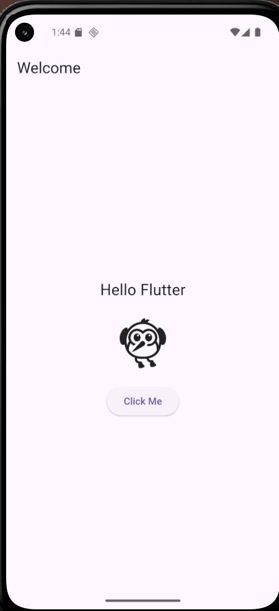

# Flutter & Dart Basics – Sprint 2

## Project Overview
This project is the first hands-on deliverable of Sprint #2. It introduces Flutter and Dart fundamentals by setting up the Flutter environment, understanding project structure, and building a simple interactive UI screen. This serves as the foundation for building scalable cross-platform mobile applications.

---

## Folder Structure
The project follows a modular Flutter structure to support scalability and clean architecture.

- `lib/main.dart`  
  Entry point of the application. Initializes the app and loads the main UI.

- `lib/screens/`  
  Contains full UI screens such as Welcome, Login, or Dashboard.

- `lib/widgets/`  
  Reusable UI components like buttons, cards, or form fields.

- `lib/models/`  
  Data models used for structuring app data (future use).

- `lib/services/`  
  Handles business logic, API calls, or Firebase integration (future use).

This structure separates concerns and makes the app easier to maintain and extend.

---

## Setup Instructions
1. Install Flutter SDK and Android Studio.
2. Verify installation:
   ```bash
   flutter doctor

## Install project dependencies:

1. flutter pub get


# Run the application:

2. flutter run -d emulator-5554


## Reflection

Through this task, I learned the fundamentals of Flutter’s widget-based architecture and the Dart programming language. I understood how Flutter builds UIs using widgets, how StatefulWidget and setState enable reactive UI updates, and why maintaining a clean folder structure is important. This structure will help in building more complex UIs and integrating Firebase features in future sprints while keeping the codebase organized and maintainable.

## Conclusion

This project successfully completes the Introduction to Flutter & Dart task by setting up the development environment, creating a clean project structure, and building a functional interactive UI. It provides a strong foundation for advanced mobile development in upcoming sprints.