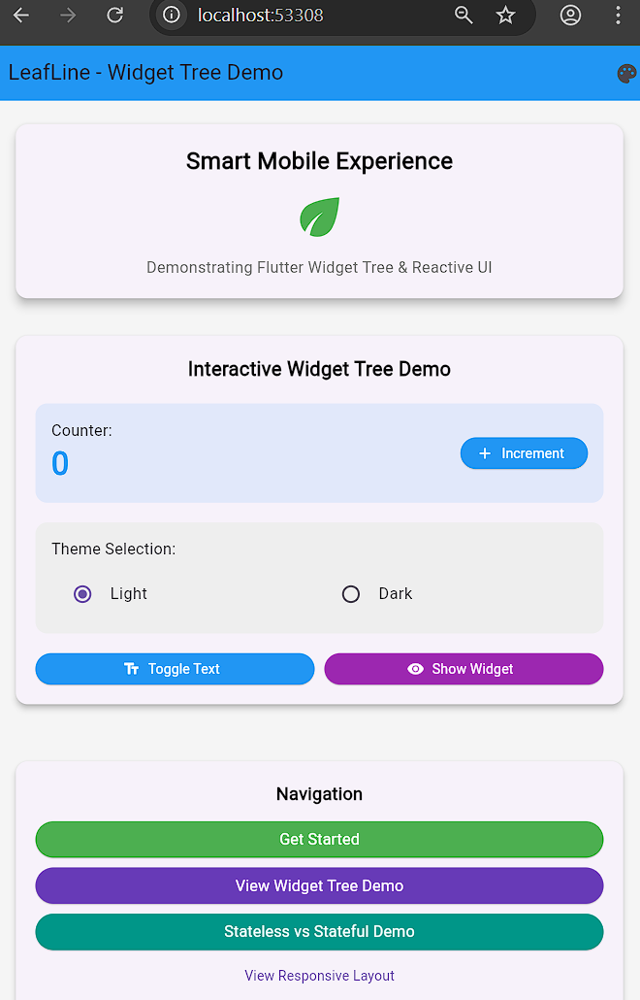
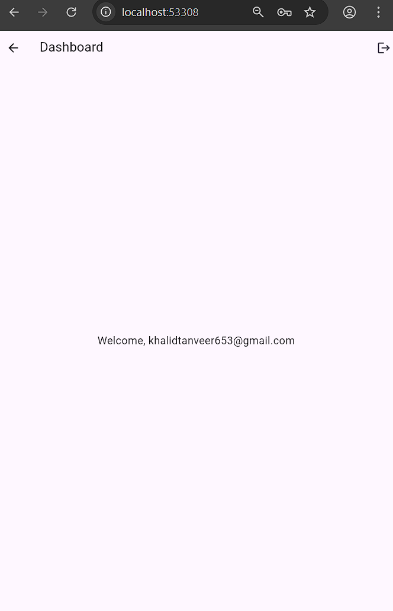

    );
  },
);

Screenshots

Reflection
How do ListView and GridView improve UI efficiency?

ListView and GridView efficiently manage scrolling content by rendering only the widgets that are visible on screen. This reduces memory usage and improves scrolling performance, especially when dealing with large or dynamic data sets.

Why are builder constructors recommended for large data sets?

Builder constructors such as ListView.builder and GridView.builder create widgets lazily. This means widgets are built only when needed, which significantly improves performance and prevents unnecessary widget creation.

What are common performance pitfalls to avoid with scrolling views?

Common pitfalls include nesting multiple scrollable widgets without controlling physics, rendering large lists without builders, and failing to constrain scrollable widgets inside fixed-height containers. Proper use of builders, constraints, and scroll physics helps avoid these issues.

Running the Application
flutter pub get
flutter run

Submission Details

Commit message:

feat: implemented scrollable layouts using ListView and GridView

Pull request title:

[Sprint-2] Scrollable Views with ListView & GridView – TeamName

